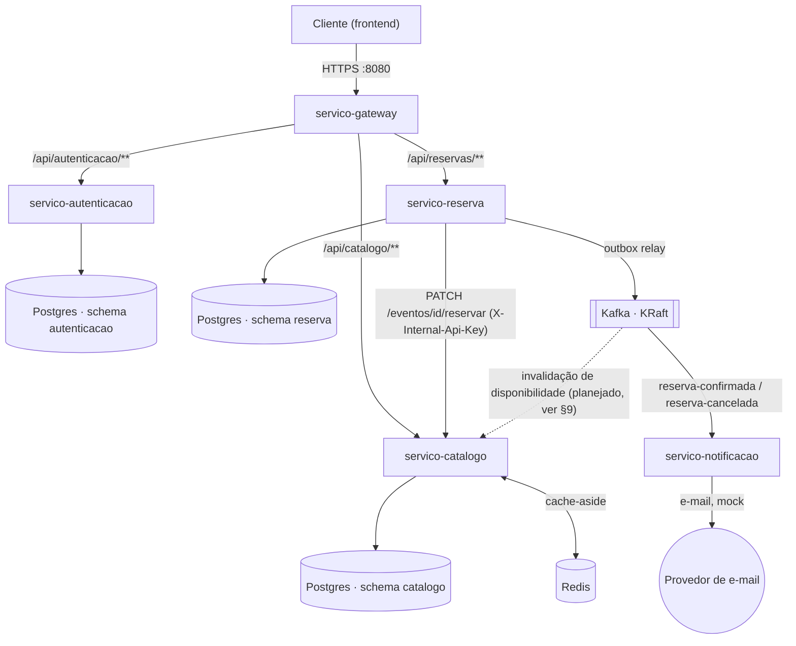
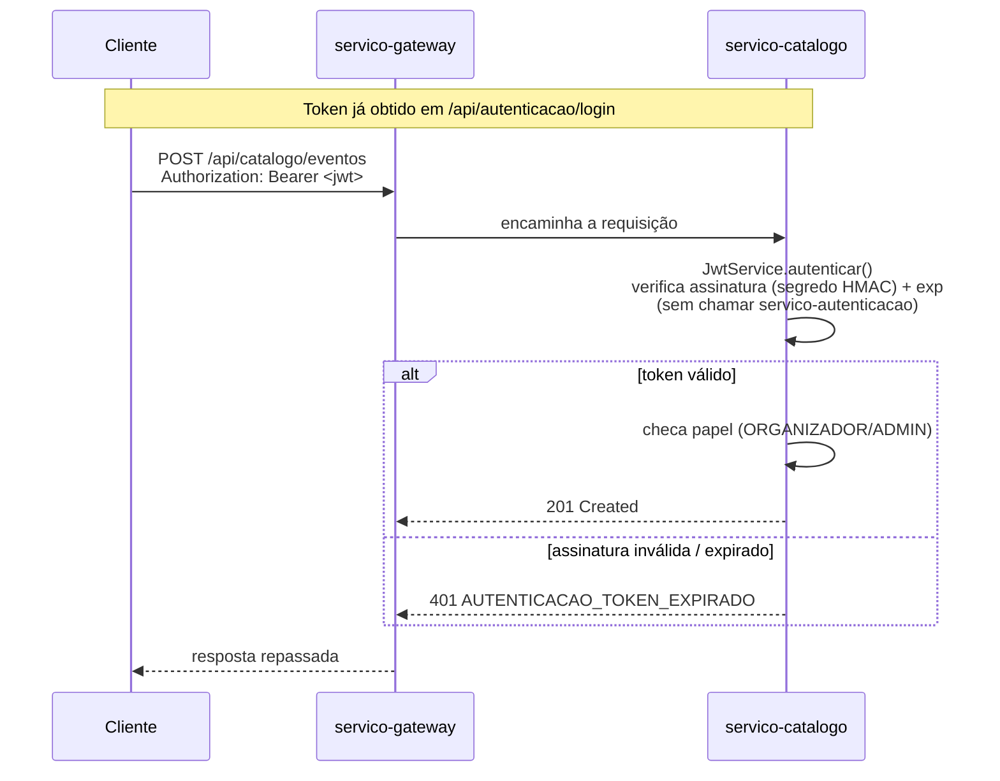
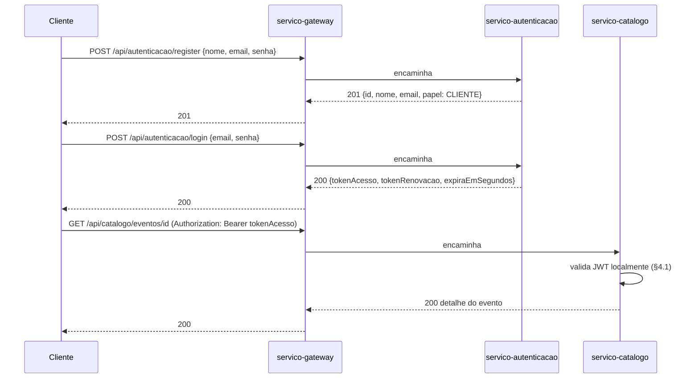
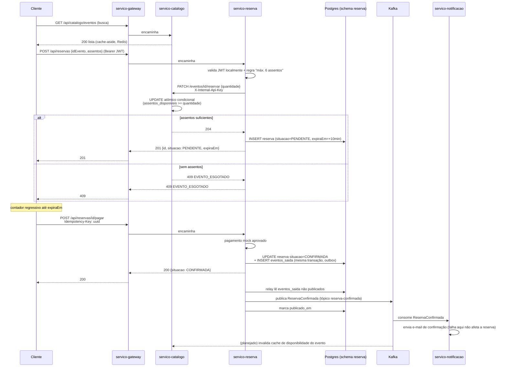
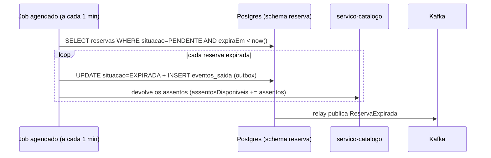

# Arquitetura — TicketFlow

Este documento é a fonte da verdade para **como as peças do sistema se encaixam**: serviços,
infraestrutura, segurança, tratamento de erros e os fluxos ponta a ponta. Para **o que** cada
endpoint faz e **quais regras de negócio** ele aplica, ver [`docs/api.md`](api.md) e
[`docs/regras-de-negocio.md`](regras-de-negocio.md) (e os arquivos equivalentes dentro de cada
serviço, os quais são a fonte da verdade real — os arquivos em `docs/` na raiz só indexam para eles).

## Sumário

1. [Visão geral](#1-visão-geral)
2. [Serviços](#2-serviços)
3. [Infraestrutura](#3-infraestrutura)
4. [Segurança](#4-segurança)
5. [Tratamento de erros](#5-tratamento-de-erros)
6. [Fluxos principais](#6-fluxos-principais)
7. [Consistência e concorrência](#7-consistência-e-concorrência)
8. [Dados](#8-dados)
9. [Estado atual da implementação](#9-estado-atual-da-implementação)
10. [Decisões técnicas e trade-offs](#10-decisões-técnicas-e-trade-offs)
11. [Como rodar localmente](#11-como-rodar-localmente)

---

## 1. Visão geral

O TicketFlow é uma plataforma de venda de ingressos dividida em **5 microsserviços** Java/Spring
Boot, com um único ponto de entrada público (`servico-gateway`) e comunicação interna síncrona
(REST) e assíncrona (Kafka).



Só o `servico-gateway` é acessível de fora da rede interna — nenhum serviço de backend deve ser
chamado diretamente pelo frontend. A exceção é a chamada `servico-reserva → servico-catalogo`
(débito de assentos), que é **servico-a-servico**, autenticada com uma chave interna compartilhada
em vez do JWT do usuário (ver [§4](#4-segurança)).

`servico-notificacao` não expõe API HTTP: ele só consome tópicos Kafka, por isso não aparece nas
rotas do gateway.

## 2. Serviços

| Serviço                | Porta | Stack                                                   | Persistência                     | Papel no sistema                                                                  |
|------------------------|-------|---------------------------------------------------------|----------------------------------|-----------------------------------------------------------------------------------|
| `servico-gateway`      | 8080  | Spring Cloud Gateway (reativo/WebFlux)                  | —                                | Ponto único de entrada; roteamento por prefixo de path; (planejado) rate limiting |
| `servico-autenticacao` | 8081  | Spring Web (servlet) + Spring Data JPA                  | Postgres · schema `autenticacao` | Cadastro, login, emissão de JWT, OAuth2 (Google)                                  |
| `servico-catalogo`     | 8082  | Spring Web (servlet) + Spring Data JPA + Redis          | Postgres · schema `catalogo`     | CRUD de eventos, disponibilidade de assentos, cache                               |
| `servico-reserva`      | 8083  | Spring Web (servlet) + Spring Data JPA + Kafka producer | Postgres · schema `reserva`      | Reservas, pagamento (mock), publicação de eventos (outbox)                        |
| `servico-notificacao`  | 8084  | Spring Kafka (consumer) + Spring Mail                   | —                                | Consome eventos de reserva, envia e-mails                                         |

Cada serviço é um módulo Maven independente (pom próprio, sem parent compartilhado), com seu
próprio `Dockerfile` — build multi-stage (`maven:3.9-eclipse-temurin-21` → `eclipse-temurin:21-jre-alpine`)
para manter a imagem final pequena, sem o JDK/Maven completo.

Todos os serviços compartilham a mesma convenção de pacote-base (`com.ticketflow.<serviço>`) e a
mesma estrutura de tratamento de erros (ver [§5](#5-tratamento-de-erros)).

## 3. Infraestrutura

Definida em [`docker-compose.yml`](../docker-compose.yml), com valores default sobrescrevíveis por
`.env` (ver [`.env.example`](../.env.example)):

- **PostgreSQL único** (`ticketflow`), **um schema por serviço** que precisa de persistência
  relacional (`autenticacao`, `catalogo`, `reserva`) — `servico-gateway` e `servico-notificacao`
  não têm schema. Os schemas são criados automaticamente por
  [`docs/db/init.sql`](db/init.sql), montado em `/docker-entrypoint-initdb.d/` e executado pelo
  próprio entrypoint da imagem oficial do Postgres na primeira subida do volume. O usuário/senha
  (`ticketflow` / `POSTGRES_PASSWORD`) também são criados automaticamente por esse mesmo mecanismo,
  via `POSTGRES_USER`/`POSTGRES_PASSWORD`/`POSTGRES_DB`; o `init.sql` só cria os schemas e os
  atribui (`AUTHORIZATION`) a esse usuário, que já nasce dono deles.
- **Redis**, usado hoje só pelo `servico-catalogo` como cache de leitura (cache-aside).
- **Kafka em modo KRaft** (sem Zookeeper), broker único — `servico-reserva` publica, `servico-notificacao`
  consome.
- Cada serviço de backend com banco só sobe depois que o Postgres passa no healthcheck
  (`depends_on: condition: service_healthy`); o mesmo vale para `servico-reserva`/Kafka e
  `servico-catalogo`/Redis.

Migrações de schema são gerenciadas por **Flyway**, uma instância por serviço, restrita ao próprio
schema (`spring.flyway.schemas`/`default-schema`), rodando automaticamente no boot da aplicação
(`ddl-auto: validate` no Hibernate — o schema do banco é sempre gerado pelas migrações, nunca pelo
JPA).

## 4. Segurança

Dois mecanismos de autenticação distintos, para dois tipos de chamador diferente:

### 4.1 JWT (usuário final)

`servico-autenticacao` é o único emissor de tokens. O token de acesso carrega `sub` (id do
usuário) e `papel` (`CLIENTE`, `ORGANIZADOR` ou `ADMIN`) como claims, assinado com HMAC usando um
segredo compartilhado (`JWT_SECRET`) entre **todos** os serviços.

Isso é o que permite que `servico-catalogo` (e, quando implementado, `servico-reserva`) **validem
o token localmente** — conferem assinatura e expiração sem nenhuma chamada de rede ao
`servico-autenticacao` — trade-off deliberado de disponibilidade/latência: o sistema de compras não
para se o serviço de autenticação cair, e não paga uma chamada HTTP extra por requisição.
Implementado hoje em `servico-catalogo` (`security.JwtService`).



### 4.2 Chave de API interna (serviço-a-serviço)

Chamadas de backend para backend — hoje, `servico-reserva → servico-catalogo` ao debitar assentos
de um evento — não carregam um usuário; usam o header `X-Internal-Api-Key`, comparado em **tempo
constante** (`MessageDigest.isEqual`, não `.equals()`) contra `INTERNAL_API_KEY`, para não vazar
por timing quantos caracteres da chave o chamador acertou. Implementado hoje em `servico-catalogo`
(`security.InternalApiKeyService`); é o lado que *recebe* a chamada — o lado que a *envia*
(`servico-reserva`) ainda não existe (ver [§9](#9-estado-atual-da-implementação)).

### 4.3 Autorização por papel

- `CLIENTE`: pode navegar o catálogo e criar/pagar/cancelar as próprias reservas.
- `ORGANIZADOR`: tudo que `CLIENTE` faz, mais criar/editar/excluir os **próprios** eventos.
- `ADMIN`: gerencia eventos de qualquer organizador.

A checagem de papel acontece na camada de service (não em um filtro central), *antes* de tocar no
banco — ver o comentário em `EventoService.atualizarEvento`: checar papel antes de checar posse
evita que um usuário rebaixado depois de criar um evento continue editando eventos antigos.

## 5. Tratamento de erros

Todos os serviços seguem a mesma estrutura de exceções, em `com.ticketflow.<serviço>.exception`:

- **`NegocioException`** — classe abstrata base (`RuntimeException`); toda exceção de negócio
  carrega o `HttpStatus` e o **código de erro** estável (ex.: `EVENTO_ESGOTADO`) usado no contrato
  de API.
- **`ElementoNaoEncontradoException`** (404), **`RegraDeNegocioException`** (422) e
  **`ValidacaoException`** (400, com lista opcional de `detalhes`) — subclasses genéricas
  reutilizáveis em qualquer serviço.
- Exceções **específicas de domínio** vivem só no serviço dono da regra — ex.:
  `servico-catalogo` tem `EventoEsgotadoException`, `EventoPossuiReservasAtivasException`,
  `AcessoNegadoException`, `AutenticacaoInternaInvalidaException`, `TokenInvalidoException`.
- **`GlobalExceptionHandler`** (`@RestControllerAdvice`) centraliza a tradução de qualquer
  `NegocioException` (e subclasses) para o formato de resposta padronizado, mais um fallback
  genérico (`Exception` → 500) e um handler para `MethodArgumentNotValidException` (Bean
  Validation) que **converge para `ValidacaoException`** — uma falha de `@Valid` no corpo da
  requisição produz exatamente a mesma forma de resposta que uma `ValidacaoException` lançada à
  mão no service.

Formato de erro (`ErroResposta`), igual em todos os serviços — este é o contrato publicado em
[`servico-gateway/docs/api.md`](../servico-gateway/docs/api.md):

```json
{
  "dataHora": "2026-08-27T20:15:00",
  "codigoStatus": 409,
  "erro": "EVENTO_ESGOTADO",
  "mensagem": "Não há assentos suficientes disponíveis para este evento.",
  "caminho": "/api/reservas",
  "detalhes": null
}
```

> **Gap conhecido:** o `servico-catalogo` já está no formato final acima, com `NegocioException`
> carregando um `codigo` por subclasse (ex.: `EVENTO_ESGOTADO`, `AUTENTICACAO_ACESSO_NEGADO`). Os
> outros quatro serviços ainda estão na versão anterior do scaffold — sem o campo `codigo` e com
> `ErroResposta` usando `timestamp`/`status`/`erro`/`mensagem`/`caminho`/`detalhes` em vez de
> `dataHora`/`codigoStatus`/(...). Ao implementar a primeira rota de negócio de cada um desses
> serviços, alinhar o `NegocioException`/`ErroResposta`/`GlobalExceptionHandler` deles ao padrão do
> `servico-catalogo` (com os códigos já definidos na tabela de
> [`servico-gateway/docs/api.md`](../servico-gateway/docs/api.md)).

## 6. Fluxos principais

### 6.1 Cadastro, login e uso do token



O token de renovação (`tokenRenovacao`) é de uso único — trocado por um novo par via
`POST /api/autenticacao/refresh`, o antigo é invalidado (rotação), reduzindo o impacto de um token
de renovação vazado.

### 6.2 Fluxo de compra ponta a ponta

Este é o fluxo central do sistema e o que mais atravessa serviços. `servico-reserva` e
`servico-notificacao` estão especificados aqui conforme
[`servico-reserva/docs/regras-de-negocio.md`](../servico-reserva/docs/regras-de-negocio.md) — a
implementação ainda não existe (ver [§9](#9-estado-atual-da-implementação)); este diagrama é o
contrato que a implementação deve seguir.



Pontos que o diagrama acima explicita e que valem destacar:

- O desconto de assentos acontece **na criação da reserva** (hold), não só na confirmação do
  pagamento — é isso que evita overselling entre o clique em "comprar" e o pagamento.
  `servico-catalogo` já implementa a ponta que recebe esse débito
  (`EventoService.reservarAssentos` + `EventoRepository.reservarAssentos`, um único `UPDATE`
  condicional).
- O evento só é publicado no Kafka depois que a mudança de estado da reserva foi de fato
  commitada no Postgres — padrão **outbox** (ver [§7](#7-consistência-e-concorrência)).
- Falha ao enviar o e-mail de confirmação nunca deve reverter ou re-processar a reserva — é uma
  consequência assíncrona, não uma dependência do fluxo de compra.

### 6.3 Expiração automática de reserva



### 6.4 Cancelamento de reserva confirmada

Só permitido até 24h antes da data do evento (`RESERVA_JANELA_CANCELAMENTO_ENCERRADA` depois
disso). Devolve os assentos ao evento e publica `ReservaCancelada` pelo mesmo mecanismo de outbox
do fluxo de pagamento — `servico-notificacao` consome esse tópico para o e-mail de
cancelamento/reembolso simulado.

## 7. Consistência e concorrência

| Problema                                                                    | Mecanismo                                                                                                                                       | Onde                                                                                                                              |
|-----------------------------------------------------------------------------|-------------------------------------------------------------------------------------------------------------------------------------------------|-----------------------------------------------------------------------------------------------------------------------------------|
| Duas reservas disputando o último assento                                   | `UPDATE` atômico e condicional (`assentos_disponiveis >= :quantidade` na cláusula `WHERE`) — não um find-then-save                              | `EventoRepository.reservarAssentos` (`servico-catalogo`, implementado)                                                            |
| Publicar um evento sem a transação de negócio ter commitado (ou vice-versa) | Padrão **Outbox**: grava o evento na mesma transação da mudança de estado, um relay separado publica no Kafka e marca como publicado            | `reserva.eventos_saida` (schema pronto, relay ainda não implementado)                                                             |
| Retry de rede duplicando uma cobrança                                       | Header `Idempotency-Key` obrigatório em `POST /reservas/{id}/pagar`: mesma chave para a mesma reserva retorna a mesma resposta, sem reprocessar | Especificado em `servico-reserva/docs/regras-de-negocio.md` 3.4 (ainda não implementado)                                          |
| Cache servindo disponibilidade desatualizada                                | Cache-aside com TTL curto (30s) + invalidação orientada a evento                                                                                | `servico-catalogo` (TTL implementado; invalidação por evento externo ainda usa um canal Redis Pub/Sub genérico — ver nota abaixo) |
| Força bruta em login                                                        | 3 tentativas inválidas consecutivas por e-mail bloqueiam por 60s                                                                                | Especificado em `servico-autenticacao/docs/regras-de-negocio.md` 1.2 (ainda não implementado)                                     |

**Nota sobre invalidação de cache:** a regra de negócio (`servico-catalogo/docs/regras-de-negocio.md`
2.3) descreve invalidação via o próprio `servico-reserva` publicando eventos de reserva no Kafka, e
`servico-catalogo` consumindo-os para limpar a chave correspondente. O código hoje
(`CacheEvictionListenerConfig`) já implementa um listener de **Redis Pub/Sub** (canal
`servico-catalogo:cache-evict`) que limpa todos os caches ao receber qualquer mensagem — mecanismo
genérico, pensado para uma futura "API de escrita" separada publicar nesse canal, mas **nada
publica nesse canal hoje** (nem o Kafka consumer descrito na regra de negócio existe ainda). Até
`servico-reserva` ser implementado, a disponibilidade cacheada só se corrige pelo TTL de 30s.
Resolver essa divergência (Kafka vs. Redis Pub/Sub) é um próximo passo em aberto.

## 8. Dados

| Schema         | Tabelas                                                                                                                                                                        | Dono                   |
|----------------|--------------------------------------------------------------------------------------------------------------------------------------------------------------------------------|------------------------|
| `autenticacao` | `usuarios` (id, email único, senha_hash, papel, criado/atualizado_em)                                                                                                          | `servico-autenticacao` |
| `catalogo`     | `eventos` (id, nome, local, data_evento, total_assentos, assentos_disponiveis, organizador_id, ativo, criado/atualizado_em)                                                    | `servico-catalogo`     |
| `reserva`      | `reservas` (id, evento_id, usuario_id, assentos, situacao, expira_em, criado/atualizado_em); `eventos_saida` (outbox: id, id_agregado, tipo_evento, dados JSONB, publicado_em) | `servico-reserva`      |

Cada schema é gerenciado exclusivamente pelas migrações Flyway do próprio serviço — nenhum serviço
lê ou escreve diretamente no schema de outro; toda integração passa por API (síncrona) ou Kafka
(assíncrona). `eventos.ativo` é uma flag de soft delete: `DELETE /eventos/{id}` marca
`ativo = false` (preserva histórico para reservas já feitas) e um `@SQLRestriction("ativo = true")`
na entidade filtra automaticamente linhas inativas de toda leitura via JPA — bulk updates JPQL
(como o débito de assentos) precisam repetir essa condição manualmente, já que `@SQLRestriction`
não se aplica a elas.

## 9. Estado atual da implementação

Boa parte de `docs/` (regras de negócio e API) descreve o **contrato alvo** do sistema, escrito
antes ou em paralelo à implementação. Nem todo endpoint documentado existe em código ainda — esta
seção existe para não confundir as duas coisas.

| Serviço                | Implementado                                                                                                                                                                                                                                        | Ainda não implementado                                                                                                                                                                                                                                                                                                                                                               |
|------------------------|-----------------------------------------------------------------------------------------------------------------------------------------------------------------------------------------------------------------------------------------------------|--------------------------------------------------------------------------------------------------------------------------------------------------------------------------------------------------------------------------------------------------------------------------------------------------------------------------------------------------------------------------------------|
| `servico-gateway`      | Roteamento por path para os 3 serviços com API HTTP; scaffold de exceções                                                                                                                                                                           | Rate limiting por IP; auditoria de escrita                                                                                                                                                                                                                                                                                                                                           |
| `servico-autenticacao` | Schema/migração (`usuarios`); scaffold de exceções; `JWT_SECRET`/`JWT_EXPIRATION_MINUTES` configurados                                                                                                                                              | Cadastro, login, refresh, OAuth2 Google, bloqueio por tentativas — nenhum controller/service existe ainda                                                                                                                                                                                                                                                                            |
| `servico-catalogo`     | CRUD de eventos completo; autorização por papel e posse; validação de JWT local; débito atômico de assentos (endpoint interno); cache Redis cache-aside com TTLs por endpoint; soft delete; exceções com código de erro alinhado ao contrato de API | Consumo de eventos Kafka do `servico-reserva` para invalidação de cache (existe só o listener genérico Redis Pub/Sub, sem publisher)                                                                                                                                                                                                                                                 |
| `servico-reserva`      | Schema/migração (`reservas`, `eventos_saida`); scaffold de exceções; `spring-kafka` (producer) configurado                                                                                                                                          | Toda a lógica de negócio: criação de reserva (débito de assentos via `PATCH /eventos/{id}/reservar`, repassando `EVENTO_ESGOTADO` do catálogo sem tradução), pagamento mock, idempotência, expiração agendada (com devolução de assentos via `PATCH /eventos/{id}/liberar`, ainda não implementado no catálogo), outbox relay, cancelamento — nenhum controller/service existe ainda |
| `servico-notificacao`  | Configuração do consumer Kafka (bootstrap servers, group id, deserializer JSON); scaffold de exceções                                                                                                                                               | Listeners dos tópicos `reserva-confirmada`/`reserva-cancelada`; envio de e-mail; dead-letter topic                                                                                                                                                                                                                                                                                   |

Em resumo: **`servico-catalogo` é o único serviço com regras de negócio implementadas hoje.** Os
demais têm a infraestrutura (schema, config de mensageria, scaffold de erros) pronta para receber a
implementação, seguindo o contrato já documentado em cada `docs/regras-de-negocio.md` e
`docs/api.md` de serviço.

> **`servico-catalogo` não deve ser lido como um contrato congelado.** Como é o único serviço
> pronto, ele foi implementado sem um par real do outro lado das integrações (`servico-reserva`
> chamando `PATCH /eventos/{id}/reservar`, `servico-autenticacao` emitindo os JWTs que ele só
> valida). É esperado que pontos hoje implementados só em `servico-catalogo` — o formato exato do
> payload interno, o mecanismo de invalidação de cache (§7), possivelmente até claims do JWT —
> precisem ajustar quando `servico-reserva` e `servico-autenticacao` forem implementados de fato e
> a integração for testada ponta a ponta. Tratar como o design mais maduro disponível hoje, não
> como algo que os outros serviços devem necessariamente se curvar a replicar sem revisão.

## 10. Decisões técnicas e trade-offs

- **Um Postgres, schema por serviço**: um único banco (`ticketflow`) com schemas separados em vez
  de uma instância por serviço. Mantém isolamento lógico dos dados sem a sobrecarga operacional de
  múltiplos bancos — razoável para o porte atual do projeto. Evolução natural, se necessário:
  separar em bancos físicos por serviço (a separação por schema já deixa essa migração menos
  invasiva, já que nenhum serviço depende de tabelas de outro).
- **Kafka em modo KRaft**: dispensa Zookeeper, reduzindo a complexidade da infraestrutura local.
- **Outbox pattern no `servico-reserva`**: garante que o evento de reserva só é publicado se a
  transação de negócio foi commitada com sucesso — evita o cenário clássico de "salvei no banco mas
  a mensageria caiu antes de publicar" (ou o inverso).
- **JWT validado localmente, sem chamar `servico-autenticacao` a cada requisição**: prioriza
  disponibilidade e latência do fluxo de compra sobre a possibilidade de revogar um token antes do
  `exp` (não há, hoje, uma lista de revogação central — um token vazado é válido até expirar).
- **Redis com TTL curto no `servico-catalogo`**: cache de disponibilidade, pensado para ser
  invalidado por evento assim que uma reserva muda de estado (ver ressalva em [§7](#7-consistência-e-concorrência)
  sobre o mecanismo ainda não estar conectado ponta a ponta).
- **Um pom.xml por serviço, sem parent Maven compartilhado**: cada serviço declara suas próprias
  dependências e versões (Spring Boot 3.3.4 em todos, hoje) — simples de entender por serviço, ao
  custo de precisar atualizar versões manualmente em cada `pom.xml` quando necessário.

## 11. Como rodar localmente

```bash
cp .env.example .env   # ajustar segredos se necessário
docker compose up --build
```

Ver [`README.md`](../README.md) para os detalhes. Isso sobe Postgres, Redis, Kafka e os 5 serviços;
os schemas do Postgres são criados na primeira subida do volume via
[`docs/db/init.sql`](db/init.sql).
